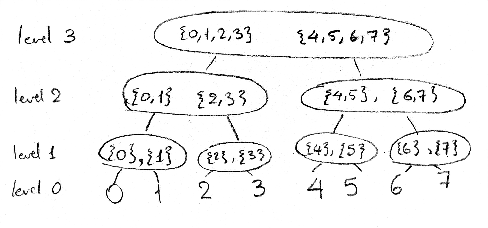
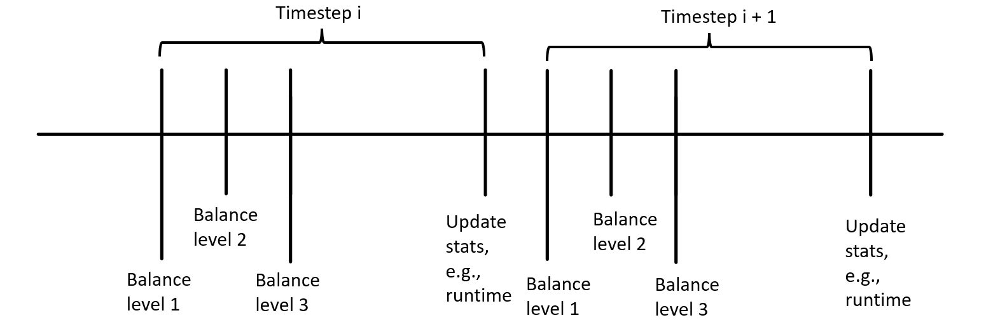
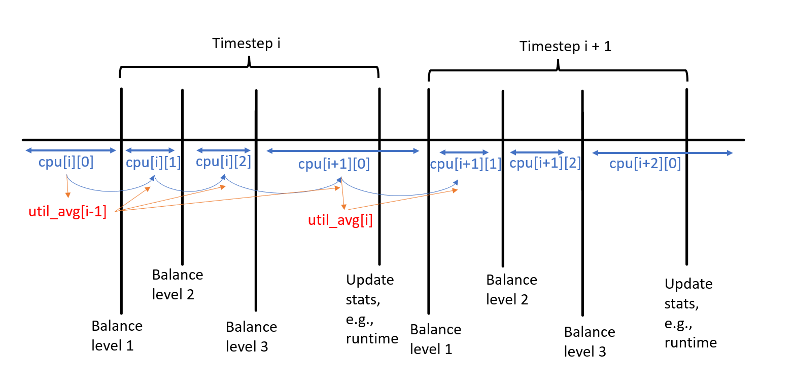

# How load balancing works
## Summary
At ["regular intervals"](#regular-intervals-and-algorithm-termination), each CPU traverses the ["domain hierarchy"](#domain-hierarchy) from the bottom up, and does load balancing if it is the ["responsible"](#responsible-cpu) CPU.
If the group of the responsible CPU is not the ["busiest"](#busiest-group), the CPU finds the busiest group.
If there is ["considerable imbalance"](#considerable-imbalance) between the two groups, the balancer picks the "busiest" CPU in the source group to steal from. 
It tries to steal as many tasks as would "relieve the source group of excess load" and/or "fairly distribute the load" between the source and destination groups.

The longer version of the algorithm only details what the quoted phrases mean.
## More details
### Domain hierarchy
Explained in the [google doc](https://docs.google.com/document/d/1N9fz2yBGm7qwDxouE5w6brE3mlB2wXUXjaVazYIufno/edit#heading=h.egwp5xi98gug).
### Responsible CPU
The CPU responsible for load balancing in a domain `d` is the first idle CPU in `d`, or the first CPU in the `balance_mask` (see [Domain Hierarchy](#domain-hierarchy)) if there are no idle CPUs in `d` at all.
There are several differences between the idle balancer and the periodic balancer:
- An idle CPU balances at a higher frequency than a busy CPU (not modelled, see [Assumptions](#assumptions))
- An idle CPU seeks to fill the empty capacity in its group without forcing the source group into idleness. On the other hand, the purpose of the periodic balancer is to reduce the excess load in the source group without overloading its local group. For an informal description of what this means, see [considerable imbalance](#considerable-imbalance). For the detailed calculations, see [the kernel code](https://elixir.bootlin.com/linux/v5.19.4/source/kernel/sched/fair.c#L9429).
### Busiest group
The busiest type of group is overloaded, which has more tasks than CPUs and "too much" utilization or "long" waiting times.
Then come fully busy groups, which are defined as neither overloaded nor having spare capacity. Groups which have spare capacity (the least busy type) are those which have fewer tasks than CPUs, or "too little" utilization and "short" waiting times.
### Considerable imbalance
After determining the [busiest group](#busiest-group), the imbalance is calculated based on the type of the local group and the busiest group. The periodic balancer only proceeds if the busiest group is overloaded (i.e. has excess load to shed) and the local group is fully busy or less loaded than average (the balancer doesn't want to overload its local group!).
The idle balancer works even if the busiest group is not overloaded, but the busiest group must have at least more than one task. Other than that, the balancer (whether idle or periodic) must also make sure that the local group is "considerably" less busy than the busiest group.

If the local group has spare capacity, it just tries to fill it. How it does so depends on the type of the busiest group. So, if the busiest group is overloaded, the CPU will want to steal as many tasks as would fill the gap between the local group's utilization and its capacity.
(It could happen that the local group's utilization is more than capacity despite being classified as "has spare". In this case, if the balancer is idle, it will just try to steal exactly one task.) And if the busiest group is fully busy, the balancer tries to even out the number of tasks (if the busiest group has only one CPU), or even out the number of idle CPUs otherwise.
Finally, if the local group is fully busy or overloaded, the balancer will try to migrate as much load as would raise the load of the local group to the domain average, or lower the busiest group's load to the domain's average, whichever is less.

As for the words "considerable" or "too much" or "too little", they depend on the context. Usually, they have to do with the `imbalance_pct` watermark.
### Regular Intervals and Algorithm Termination
Broadly speaking, a CPU starts the balancing algorithm for domain `sd` [after `sd->balance_interval` has passed since `sd->last_balance`](https://elixir.bootlin.com/linux/v5.19.4/source/kernel/sched/fair.c#L10444).

So if the struct `sd` (in particular, `sd-last_balance`) is shared among the CPUs in it, and if `sd->balance_interval` is unchanged, `sd` will be balanced once every `sd->balance_interval` by exactly one CPU. This is what I have assumed.

To illustrate what this means, suppose we have 8 CPUs and two levels. Level 1 has domains `[0, 1, 2, 3]` and `[4, 5, 6, 7]`, and level 2 has all of them in a single domain. At some instant in time, `0` is busy, and `1` and `2` are idle (the rest of the CPUs are irrelevant).
`1` is the CPU responsible for balancing `[0, 1, 2, 3]`, so it will steal some work and become busy. What happens next in the model is that `2` finds that it's the responsible one for level 2 and does the balancing.
But this is not exactly what happens in the kernel because a CPU [stops traversing the hierarchy altogether](https://elixir.bootlin.com/linux/v5.19.4/source/kernel/sched/fair.c#L10005) when it's not the responsible CPU for a single domain.
This makes sense, at least because in the real kernel which has overheads for balancing, while `1` is busy searching for tasks to steal, `2` will still see that `1` is idle and that it is not responsible for balancing any domain no matter how far it ascends. `2` had better stop traversing and start balancing later.

But what is not clear for me is: *when* does `2` start balancing again?

If `sd-last_balance` is shared among the CPUs, at the next `scheduler_tick()`, `2` will find that `[0, 1, 2, 3]` shouldn't be balanced just yet, and would simply proceed at level 2, which is very similar to what the model does because `scheduler_tick`s are much more frequent that `balance_intervals`. 

But there are two iffy parts in that last sentence:
1. `sched_domain` structs are [built independently for each CPU](https://elixir.bootlin.com/linux/v5.19.4/source/kernel/sched/topology.c#L2274), and are accessed and *modified* (for example when updating `last_balance` and `nr_balance_failed`) _without locks_. These two facts hint that it might be that CPUs are unaware of each others' balancing activities.
2. `1` doesn't just stop right when it finds some work at level 1. It tries to balance level 2, too, but finds that it's no longer responsible, so it doesn't balance. But still it updates `sd->last_balance`. So even when a CPU fails in balancing, it modifies `sd->last_balance`.

So, with my current understanding, anything is possible. It might be that `last_balance` is shared but because `1` modifies it for level 2, `2` would start at level 3 if there were one, not at level 2. Or it might be that `last_balance` is not shared (which, on an unrelated note, would have some implications for `nr_balance_failed`, see [What's next](#what-is-next)) so `2` will start balancing at level 1.
Notably, it wouldn't be difficult to adapt the model to the latter scenario, we only have to make `should_we_balance` aware of what happened at the previous stages, or evaluate it for each CPU and parent domain at the beginning of the timestep. We just need to figure out what happens.

But then.. what about `sd->balance_interval`? That, too, is not constant. Each `sched_domain` has `sd->min_interval` (which, contrary to the real kernel, I've [assumed](#assumptions) [equal for all `sched_domain`s](https://elixir.bootlin.com/linux/v5.19.4/source/kernel/sched/topology.c#L1565) and [for both idle and periodic balancers](https://elixir.bootlin.com/linux/v5.19.4/source/kernel/sched/fair.c#L10247), and till now this assumption seems harmless), and `sd->max_interval` which is twice the `min_interval`.
When a CPU fails in balancing because it's not responsible or it didn't find a suitable source group or a suitable task, it [doubles `sd->balance_interval`](https://elixir.bootlin.com/linux/v5.19.4/source/kernel/sched/fair.c#L10236) if it's not already `sd->max_interval`. Otherwise, `sd->balance_interval` is [reset](https://elixir.bootlin.com/linux/v5.19.4/source/kernel/sched/fair.c#L10192) to `sd->min_interval`.
This is yet another fact supporting the possibility that `sd->balance_interval` is not shared, because why delay other CPUs which could potentially succeed just because one CPU failed?

I believe a deeper understanding of the "interval" stuff is necessary to assess the validity of the model and its assumptions, or to modify it. 
# Model
## Running Example

## Timestep
A single timestep consists of many stages. To illustrate using the running example:

This is a conceptual timeline. For the specific indices used for each state, see [implementaion](#implementation).
## Constraints
### Task Constraints
1. A task is assigned a CPU from the available CPUs.
2. All stats are percentages (range from 0 to 1).
3. `util_avg <= runnable_avg` and `runtime <= runnable` because a task must be runnable if it utilizes the CPU, but does not necessarily run if it is runnable.
4. `util_avg` and `runnable_avg` are `ewma(runtime)` and `ewma(runnable)` respectively.
5. Because tasks do not block, `runnable` is always 1 for all tasks.
6. `task.runtime == 1/cpu.nr_running`, where `cpu` is the `cpu` the task is running on.
### Migration Constraints
Suppose a task migrates from CPU `a` to CPU `b`. If `b` is the periodic balancer, this implies the following:
1. `group_of(a) != group_of(b)`
2. `a` is the only source CPU for migrations in this domain.
3. `b` is the only destination CPU for migrations in this domain.
4. `b` is the first CPU (in the `balance_mask`) of domain and there are no idle CPUs in the domain.
5. `group_of(a)` is among the busiest in domain.
6. `a` is the busiest CPU in `group_of(a)`
7. `sum(metric for each migrating task) <= imbalance`
8. Any other task remaining in `a` would have exceeded the `imbalance` had it migrated, or would have left `a` idle.

See [here](https://elixir.bootlin.com/linux/v5.19.4/source/kernel/sched/fair.c#L10031), [here](https://elixir.bootlin.com/linux/v5.19.4/source/kernel/sched/fair.c#L7923) and [here](https://elixir.bootlin.com/linux/v5.19.4/source/kernel/sched/fair.c#L7828). The running task will certainly not migrate, but it could happen that the periodic balancer leaves the source CPU empty.

And if `b` is the idle balancer, it implies:
1. `group_of(a) != group_of(b)`
2. `a` is the only source CPU for migrations in this domain.
3. `b` is the only destination CPU for migrations in this domain.
4. `b` is the first idle CPU of domain.
5. `group_of(a)` is among the busiest in domain.
6. `a` is the busiest CPU in `group_of(a)`
7. `sum(metric for each migrating task) <= imbalance`
8. Any other task remaining in `a` would have exceeded the `imbalance` had it migrated, or would have left `a` idle.
9. number of tasks migrating from `a` \< number of tasks on `a`. See [here](https://elixir.bootlin.com/linux/v5.19.4/source/kernel/sched/fair.c#L7936).

However, we cannot just rely on these implications because z3 could just choose not to migrate any tasks. For each domain, we need a "satisfactory attempt" at balancing to be made.
For the periodic balancer, a satisfactory attempt means:
1. The local group is busiest. (no task migrates)
2. The local group is overloaded and more loaded than average. (no task migrates)
3. None of the busiest groups is considerably busier than the local group. (no task migrates)
4. None of the busiest groups is overloaded. (no task migrates)
5. None of the CPUs in the busiest groups has a suitable task. (no task migrates)
6. None of the above is true and some task actually migrates.

And for the idle balancer:
1. The local group is busiest. (no task migrates)
2. None of the busiest groups is considerably busier than the local group. (no task migrates)
3. None of the CPUs in the busiest groups has a suitable task. (no task migrates)
4. None of the above is true and some task actually migrates.

(In the model, I merge both the idle and the periodic constraints, but conceptually it is easier to think this way. Each condition is explained in more detail in code and comments.)

## Assumptions
1. All tasks have the same priorities.
2. At the moment of load balancing, all tasks are runnable.
3. Load balancing has no overheads, so there is no need to vary the balancing intervals dynamically (via [`busy_factor`](https://elixir.bootlin.com/linux/v5.19.4/source/kernel/sched/fair.c#L10247))
4. Load balancing is triggered at the same time in all cpus. Whether this assumption is reasonable or not is discussed in [Regular Intervals](#regular-intervals-and-algorithm-termination).
5. Between each two load-balancing instances, there is an integral number of pelt intervals, so no need for the divisor.
6. Homogeneous architecture
7. All tasks are CFS tasks (`SCHED_NORM`)
8. There is no newly idle balancer, see [blocking](#blocking)
9. No task pinning.

## What is next
1. Check the reasonableness of all the CPUs balancing at the same time. See [Regular Intervals](#regular-intervals-and-algorithm-termination)
2. Task pinning
   This is trivial to add. For example, each task could have a boolean corresponding to each CPU to let z3 decide whether it can run on that CPU at all.
3. Asymmetric NUMA architecture
   This should introduce no change in the model itself, but rather in how the groups are formed in each domain (which is all just python). [This function](https://elixir.bootlin.com/linux/v5.19.4/source/kernel/sched/topology.c#L1012) and [that one](https://elixir.bootlin.com/linux/v5.19.4/source/kernel/sched/topology.c#L898) should be useful.
4. `nr_balance_failed`
   Should also be trivial to add. Each domain would have a variable `nr_balance_failed`, which increases each time there is an imbalance but no suitable task to migrate, and resets when a task successfully migrates.
5. Task blocking, see [blocking](#blocking) 
6. Newly idle balancing (depends on task blocking)
   No idea how important modelling this is.
7. Task priorities.
   Trivial to add, just amend how `load_avg` is calculated for CPUs.

Active Balancing is not needed because it's used when the task which is currently running on the source CPU needs to migrate. The destination CPU cannot just pull it from the source queue, so the source CPU is told to push.
However, the model makes no distinction between running and runnable tasks.
### Blocking
Currently, `util_avg[-1]` and `runnable_avg[-1]` are up to z3 to pick. This allows different scenarios, such as:
- a task blocking for a long time --> `runnable_avg[-1] = 0`,
- a task being starved by other tasks (which have just finished) --> `runnable_avg[-1] = 1` and `util_avg[-1]` small, 
- a task just arriving
- etc.

But during all subsequent timesteps, tasks never block.

There are two ways I could think of to approach this point:
- There is no need to model blocking within the timesteps because we model the time interval just when all tasks are runnable (and any blocking is dealt with using the initial conditions).
- Try to model blocking by allowing `task.runnable < 1` and adding some extra constraints. For example:
  - `task.runtime >= task.runnable / cpu.nr_running` --> The worst case
  - `sum(task.runtime) for each task on cpu <= 1` --> Cannot consume more than 100% of CPU.
  - `sum(task.runtime) for each task on cpu >= max(task.runnable)` --> At the worst case, the CPU will at least be busy for as long as one task is runnable.
  - Among others.
  
But there are several problems with the second approach:
- When a CPU becomes idle (all tasks on it block) it should do load balancing as a `NEWLY_IDLE` CPU [in order to maintain the "work conserving" property](https://elixir.bootlin.com/linux/v5.19.4/source/kernel/sched/fair.c#L7548) (or at least a weaker form thereof). Can this be integrated to the current model?
- The constraints need more thought. Do they allow unrealistic scenarios?
## The Bugs
### Group Imbalance Bug
The current model uses the newer algorithm for group classification (in which the number of idle CPUs is taken into account when deciding whether a group is overloaded). Hence, it should not have this bug.
To check this, we could, for example, query whether a CPU could stay idle after a full timestep even when other CPUs have more than one task.
### Scheduling Group Construction Bug
The current model has the bug, but it cannot be used with asymmetric NUMA because I haven't included [`balance_mask`](https://elixir.bootlin.com/linux/v5.19.4/source/kernel/sched/topology.c#L898). So neither the bug nor the fix is modelled, needs task pinning and asymmetric NUMA support, see [What is next](#what-is-next).
### Unfairness described [here](https://lwn.net/Articles/821123/) and [here](https://lore.kernel.org/all/20200921072424.14813-2-vincent.guittot@linaro.org/)
Modelled. The current model does not support `nr_balance_failed`.
# Implementation
## Timeline

## Input
`NUM_TASKS`, `NUM_CPUS`, `NUM_TOP_LEVELS`,`NUM_TIMESTEPS`: self-evident

`TOP_LEVELS`: A list of adjacency matrices. For example, `TOP_LEVELS[2][3] = [1, 1, 1, 1, 0, 0, 0, 0]` because CPU 3 sees CPUs 0, 1, 2 and 3 in its 2nd ancestor domain.

`STAGES`: This array was introduced to have more control over balancing intervals. In the linux kernel, [the larger a domain is, the less frequently it should be balanced](https://elixir.bootlin.com/linux/v5.19.4/source/kernel/sched/topology.c#L1586). But till now, I've omitted this detail and simply assumed that we always balance all domains if any imbalance is detected.
## Output
A list of named z3 variables that show the state of tasks and CPUs, and others useful for debugging.
## Example
